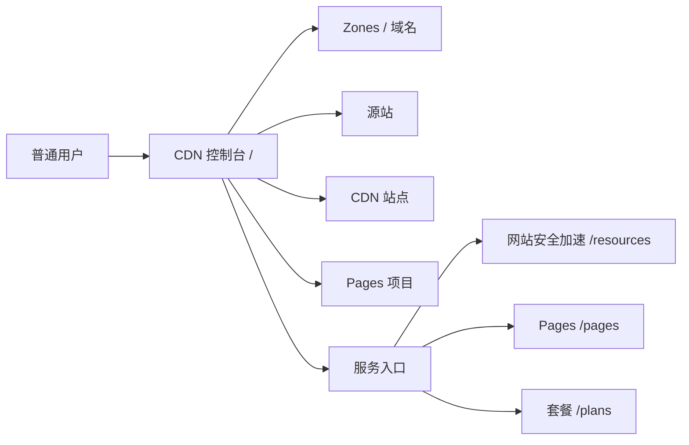

# 普通用户 CDN 控制台设计

## 目标

普通用户登录后的首页应当先回答三个问题：当前有多少站点、哪些站点正在运行、下一步应该做什么。控制台面向 CDN 使用者，不展示管理员节点、配置版本和底层 OpenResty 指标。整体信息架构参考 EdgeOne，将操作分为全局服务总览、网站列表和站点级配置三层；左侧主导航始终保留。

## 页面分工

| 页面 | 责任 | 用户操作 |
| --- | --- | --- |
| `/` | 服务总览 | 在“网站安全加速”和“Pages”两个服务之间切换，查看概况与最近项目 |
| `/resources` | 网站安全加速 | 查看网站列表、接入状态和站点入口 |
| `/resources/detail?id=:id` | 站点控制台 | 查看单站点概览，并按域名、源站、安全加速和安全防护进入配置 |
| `/resources/configure` | 网站配置 | 承载根域、子域、源站、HTTPS、限流和 WAF 的具体编辑操作 |
| `/pages` | Pages | 创建项目、上传部署包、查看部署历史 |
| `/plans` | 套餐与额度 | 查看和购买套餐 |

管理员访问 `/` 仍使用全局节点与流量总览。前端根据用户身份选择看板，管理员总览接口不会被普通用户调用。

## 数据与权限

控制台只复用现有 owner-scoped API，不新增数据库表和聚合接口：

- `/api/v1/custom/resources/zones`
- `/api/v1/custom/resources/origins`
- `/api/v1/custom/resources/proxy-routes`
- `/api/v1/custom/resources/policies`
- `/api/v1/custom/resources/pages`

所有接口继续由当前登录用户和后端 owner 过滤保护。Pages 前端服务路径必须与后端实际注册的 `/api/v1/custom/resources/pages` 保持一致，管理员通过同一路径读取全局 Pages 项目。

## 交互决策

- 顶部只保留刷新和“添加站点”两个高频操作，减少用户在首次进入时面对的配置字段。
- 四个概览指标展示站点、域名、源站和 Pages 项目数量；这些数量直接由现有资源查询计算，避免引入新的统计口径。
- 接入进度按“根域、源站、CDN 站点”三个必要步骤计算，点击快速操作进入现有资源工作区完成配置。
- 站点列表只展示状态和域名摘要，详细操作统一跳转 `/resources/detail`，避免在全局入口复制复杂表单。
- 原混合资源编辑器迁移到 `/resources/configure`，站点级侧栏只负责定位域名、源站、安全加速和安全防护等配置主题。
- `/pages` 页面使用 `/api/v1/custom/resources/pages`，修复普通用户和管理员打开 Pages 后列表请求 404 的问题。

## 非目标

本次不改变普通用户资源 API、套餐额度、发布流程和 Pages 部署模型，也不在首页加入实时访问日志或节点健康数据。需要流量统计时，后续应新增明确的 owner-scoped 观测接口并单独定义数据口径。
