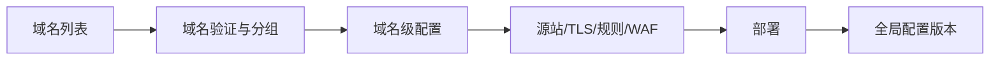

# 普通用户域名控制台设计

## 操作层级

域名是 CDN、证书和防火墙的最小配置边界，Zone 仅作为后台资源归组和权限边界。用户直接输入一个根域或子域，系统自动创建/复用 Zone 并生成该域名的 TXT 验证记录。完成验证后进入该域名的 CDN 控制台。普通用户只能读取自己的资源。部署调用用户发布额度控制的全局版本发布接口。

## 所有权验证与接入

添加域名时始终为明确域名生成独立 TXT 记录。TXT 验证通过 `net.Resolver` 完成，不能用 CNAME 替代；旧的根域继承验证接口仅用于兼容历史数据。

所有子域的接入 CNAME 固定为 `cname.edge.infvar.com`。部署前检查 CNAME，失败时阻止部署并显示配置记录。用户界面持续显示禁止自行优选 IP 的安全警告。

## 权限

全局 WAF 规则、系统 IP 组和全局默认限流策略在普通用户页面只读展示。普通用户创建的规则写入自己的 `owner_id`，且只能绑定自己的一个子域路由；规则编译时增加 Host 检测，避免同一路由规则影响其他 Host。TLS 证书和 Pages 项目同样按 owner 查询。
