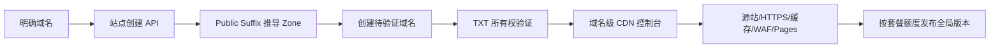

# 直接域名 CDN 控制台 Implementation Plan

## 1. 目标与背景

普通用户和管理员添加 CDN 站点时不应被迫先创建一个根域。用户只需输入一个明确域名（根域或子域），完成 TXT 所有权验证后进入域名级配置页，配置源站、备用源站、权重、Pages、HTTPS/TLS、缓存与 WAF。

V1 保留现有 Zone/ZoneDomain 数据模型和配置发布模型。Zone 继续作为 Public Suffix List 推导出的内部归组边界，用户入口改为一次性创建站点。

## 2. 设计与决策

### 核心对象

不新增表。新增站点创建逻辑会规范化输入域名、推导注册根域、按 owner 复用或创建 Zone，并创建一个待验证的 ZoneDomain。既有 ProxyRoute 已支持多上游、缓存、HTTPS、Pages、WAF 绑定，前端补齐这些字段的用户配置。

### API

* `POST /api/v1/d/sites`：管理员直接创建域名站点。
* `POST /api/v1/d/sites/:domain_id/verify`：管理员验证明确域名 TXT 记录。
* `POST /api/v1/custom/resources/sites`：普通用户按套餐额度创建域名站点。
* `POST /api/v1/custom/resources/sites/:domain_id/verify`：验证明确域名 TXT 记录。

### DNS 与 TLS

ACME DNS-01 增加 Alibaba Cloud DNS（`alidns`）、Tencent Cloud DNS（`tencentcloud`）和 Huawei Cloud DNS（`huaweicloud`）。账号授权内容保持加密 JSON，由 provider-specific 字段映射到 lego 配置；普通用户继续使用 owner-scoped TLS API。

### 数据流

## 3. 修改文件

### 后端

* `internal/repository/openflare_zone.go`：增加按 owner 和根域查找 Zone 的方法。
* `internal/apps/openflare/zone/logics.go`：增加直接站点创建及明确域名验证逻辑。
* `internal/apps/openflare/useraccess/routers.go`、`internal/router/v1/openflare/register_zone.go`：注册普通用户和管理员站点入口。
* `internal/apps/openflare/tls/acme/client.go`：接入三家 DNS provider。

### 前端

* `frontend/lib/services/custom/*`、`frontend/lib/services/openflare/*`：增加站点创建服务和 provider 类型。
* `frontend/app/(main)/resources/configure-page.tsx`：将根域/子域两步入口改为直接域名入口，并补齐源站、备用源站权重、Pages、HTTPS、缓存和 WAF 配置。
* `frontend/app/(main)/websites/*`、`frontend/app/(main)/dns-accounts/*`：同步管理员入口和三家 DNS 账号表单。

## 4. 验证计划

* `go test ./internal/apps/openflare/zone ./internal/apps/openflare/tls ./internal/repository ./internal/apps/openflare/useraccess -count=1`
* `make format`
* `make swagger`
* `make code-check`
* 前端运行类型检查/构建，确认普通用户和管理员站点创建、TXT 验证、配置保存和套餐额度请求路径。
